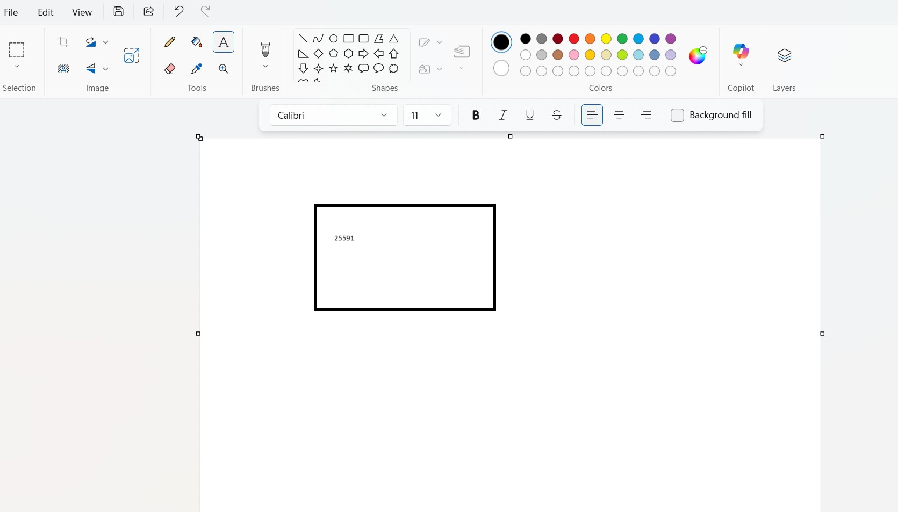
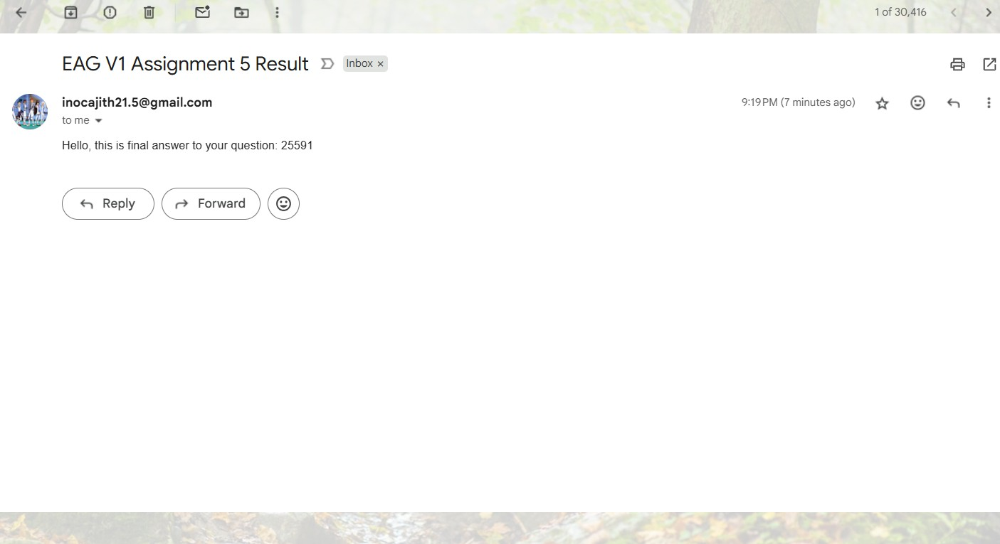

### EAG-Session-05 Assignment 

### Contents

- [Requirements](#requirements)
- [Development Method](#development-method)
    - [Overview](#Overview)
    - [Usage](#usage)
- [Learnings](#learnings)
- [Results Screenshots](#results)

### Requirements

In short write a mcp server that can 

1. Show reasoning with steps its going to do

2. convert word India to ascii characters, calculate a squared sum of each ascii values

3. Verify the result

4. open paint, create a rectange 

5. Add the answer inside the rectangle

6. Send the answer as email

From EAG course
- Redo your last assignment (4th one or 3rd one, paint one) but this time:

- Use ChatGPT or Cursor/Claude or something that qualifies your prompt with the rules mentioned in this Download thisprompt. 
- Show:
    - New final prompt qualified by ChatGPT or Cursor/Clause
    - Based on this new prompt re-do your assignment, share the README.md link for your code
    - Share the YouTube video showing your plugin's use
- Your assignment cannot be:
    - any summarizer
    - any stock, crypto analyzer, or (can be linking their price changes in the last 1 month based on news)
    - any other simple tool
    - it can be mathematically based query as in the last session, with no problem.. but must have multiple steps involved. 

### Development Method

### Overview

Write a mcp server that can 
1. Show reasoning with steps its going to do
2. convert word India to ascii characters, calculate a squared sum of each ascii values
3. Verify the result
4. open paint, create a rectange 
5. Add the answer inside the rectangle
6. Send the answer as email

Method

- Write MCP server functionalities in `paint_mcp_server.py` to draw rectangle, write text. Make sure you adjust the coordinates in accordance with your system. As they are hardcoded. Write functionality to send email.
- Write logging functionality instead of print
- Test it with `mcp dev paint_mcp_server.py`
- Now go to `talk2mcp.py` and adjust the prompts and other functionalites to satisfy the requirement

#### Usage

**Installations**

- `pip install -r requirements.txt`

**Execution**

- `python talk2mcp.py`

**Testing**

- `mcp dev paint_mcp_server.py`


### Learnings

- Learnt how to create mcp server functions, show reasoning, verification
- Learnt how to prompt

### Results

- [Youtube Video Link]()

**Prompt validation from chatgpt**

```
{
  "explicit_reasoning": true,
  "structured_output": true,
  "tool_separation": true,
  "conversation_loop": true,
  "instructional_framing": true,
  "internal_self_checks": true,
  "reasoning_type_awareness": true,
  "fallbacks": true,
  "overall_clarity": "Excellent structure: explicit reasoning, tool separation, JSON-enforced output, and verification built-in. Covers reasoning type tagging and fallbacks. Only minor improvement would be clarifying how to handle ambiguous user intent or malformed inputs."
}
```

**Paint App**



**Email functionality**



**Logs**

[Link Here](./assets/run.log)

